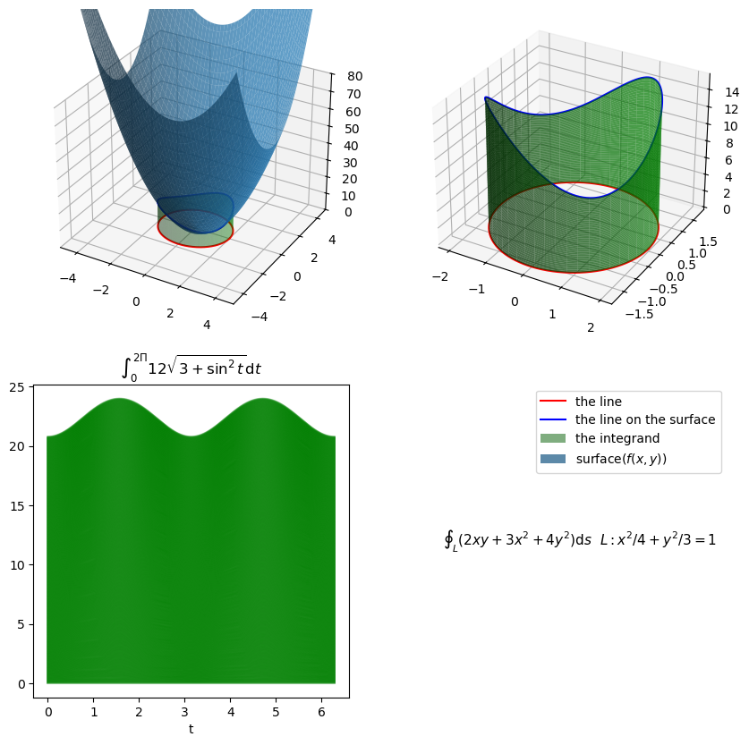

---
tags:
  - math
  - 多元函数微积分
---

# 对弧长的线积分

关联 [曲线弧长](定积分的应用.md#曲线弧长)

> [!NOTE] 
 > 计算二维平面中一条有密度的曲线的质量
 > 
 > 计算三维空间中一条曲线往 $xOy$ 平面上的投影所形成的曲面的面积(窗帘的面积)

曲线 $L$ 的参数方程

$$
\begin{cases}
x = x(t) \\
y=y(t)
\end{cases}
,a\leq t\leq b
$$

$$
\int _{L}f(x,y) \thinspace \mathrm{d}s = \int _{a}^{b} f[x(t),y(t)] \sqrt{ \left( \frac{\mathrm{d}x}{\mathrm{d}t}  \right)^{2}+\left( \frac{\mathrm{d}y}{\mathrm{d}t}  \right)^{2} } \thinspace \mathrm{d}t
$$

**要点** ：通过参数方程把对弧长的线积分化为普通的**一重积分**

> [!WARNING] 
 > 对弧长的线积分与路径方向无关
 >

$$
\int _{L}f(x,y) \thinspace \mathrm{d}s = \int _{-L}f(x,y) \thinspace \mathrm{d}s
$$

标量场线积分例题：

设 $L$ 为椭圆 $\frac{x^{2}}{4}+\frac{y^{2}}{3}=1$

参数方程：

$$
\begin{cases}
x=2\cos t \\
y=\sqrt{ 3 }\sin t
\end{cases}
,(0\leq t\leq 2\pi)
$$

则:

$$
\oint _{L} (2xy+3x^{2}+4y^{2}) \thinspace \mathrm{d}s = \int _{0}^{2\pi}12\sqrt{ 3+\sin ^{2}(t) } \thinspace \mathrm{d}t
$$

