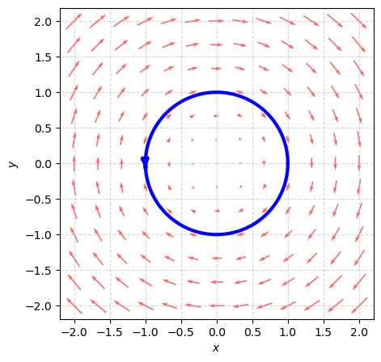

---
tags:
  - math
  - 多元函数微积分
---

# 对坐标的曲线积分

> [!NOTE] 
 > 一物体在力场 $\boldsymbol{F}$ 中沿路径 $\boldsymbol{r}$ 运动，力场对物体做的功
 > 

$$
W=\boldsymbol{F} \cdot \boldsymbol{r} = \int _{L} \boldsymbol{F} \thinspace \cdot \mathrm{d}\boldsymbol{r}
$$

有向曲线弧 $L$ 的参数方程：

$$
\begin{cases}
 x=\varphi(t) \\
 y= \psi(t)
 \end{cases}
,\alpha\leq t\leq \beta
$$

向量场函数 ：

$$
\boldsymbol{F}(x,y)=P(x,y)\boldsymbol{i}+Q(x,y)\boldsymbol{j}
$$

向量场 $\boldsymbol{F}(x,y)$ 在 有向曲线弧 $L$ 上的积分

$$
\begin{align} 
\int _{L} \boldsymbol{F}(x,y) \thinspace \mathrm{d}\boldsymbol{r} &  =\int _{L} P(x,y) \thinspace \mathrm{d}x + Q(x,y)\thinspace \mathrm{d}y \\
 & =\int _{\alpha}^{\beta} \left\{ P[\varphi(t),\psi(t)]\varphi'(t) \thinspace  + Q[\varphi(t),\psi(t)]\psi'(t) \right\}  \thinspace \mathrm{d}t
\end{align}
$$

> [!WARNING] 
 > 向量场线积分取决与路径方向

$$
\int _{L} \boldsymbol{F}(x,y) \thinspace \mathrm{d}\boldsymbol{r}=-\int _{-L} \boldsymbol{F}(x,y) \thinspace \mathrm{d}\boldsymbol{r}
$$

向量场积分例题：

设 $L$ 为正向圆周 $x^{2}+y^{2}=1$ ，向量场 $\boldsymbol{F}=(y,-x)$

则：

$$
\oint_{L} y\thinspace\mathrm{d}x-x\thinspace\mathrm{d}y=\int _{0}^{2\pi} (-\sin ^{2}t-\cos ^{2}t) \thinspace \mathrm{d}t
$$

